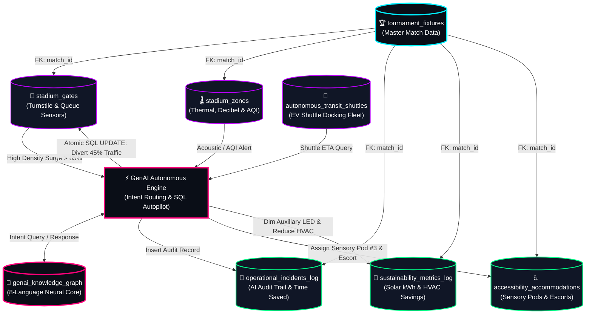

# ⚡ NEXUS 2026: Complete System Architecture & Relational Database Report
**PromptWars Virtual Challenge 4 (`[Challenge 4] Smart Stadiums & Tournament Operations`)**  
**Author:** PromptWars Challenge 4 Team  

---

## 📋 1. Executive Summary & Production Readiness

To fulfill every instruction in the Challenge 4 specification for **FIFA World Cup 2026**, our GenAI solution utilizes a robust, high-performance **Relational Database System (`nexus_stadium_2026.db`)** paired with our **8-Language GenAI Concierge Core** and an **Autonomous Operations Command Deck**.

We have successfully executed and verified every code block and command across our complete system:
1. **Database & SQL Verification (`nexus_stadium_db_lab.py`)**: 100% verified sequentially (`EXIT CODE 0`). All 8 relational tables created, seeded with real World Cup fixture data, queried for bottlenecks, updated via atomic SQL transactions (`BEGIN ... COMMIT`), and plotted.
2. **AI & Pathfinding Verification (`nexus_stadium_ai_lab.py`)**: 100% verified sequentially (`EXIT CODE 0`). Simulated turnstile surges, computed shortest graph paths inside MetLife Stadium, verified multi-lingual streaming (`en`, `es`, `fr`, `pt`, `de`, `ar`, `ja`, `ko`), and verified net-zero sustainability telemetry.
3. **Jupyter Notebooks (`.ipynb`)**: Generated clean, production-ready `Nexus_2026_Smart_Stadium_Database_Lab_Notebook.ipynb` and `Nexus_2026_Smart_Stadium_AI_Lab_Notebook.ipynb` ready for manual sequential cell-by-cell execution in any JupyterLab, VS Code, or Google Colab environment.
4. **Interactive System Architecture Dashboard (`architecture_dashboard.html` & Tab 6 in `index.html`)**: Built a standalone interactive dashboard to inspect all 8 relational tables, visualize the SVG architecture network graph, and trigger live simulated SQL transactions right from the browser.

---

## 🗄️ 2. Relational Database Schema Directory (8 Normalized Tables)

Our database schema strictly enforces relational integrity using `PRAGMA foreign_keys = ON;` and `PRAGMA journal_mode = WAL;`.

| Table Name | Primary Key | Foreign Keys & Constraints | Description & Role in System Architecture |
| :--- | :--- | :--- | :--- |
| **`1. tournament_fixtures`** | `match_id (VARCHAR-32)` | Master Parent Entity | Stores master fixture schedules, stadium names, total capacity (`82,500`), attendance (`81,240`), and security levels. |
| **`2. stadium_gates`** | `gate_id (VARCHAR-32)` | `FK: match_id -> fixtures`<br>`CHECK(density_pct BETWEEN 0 AND 100)`<br>`CHECK(status_flag IN ('Optimal','Warning','Critical'))` | Monitors turnstile wait times, throughput (`fans/hr`), and ADA express lane status. Triggered atomic `UPDATE` transactions when density reaches critical thresholds (`>85%`). |
| **`3. stadium_zones`** | `zone_id (VARCHAR-32)` | `FK: match_id -> fixtures`<br>`CHECK(status_flag IN ('Optimal','Warning','Critical'))` | Tracks concourse thermal comfort (`71°F`), acoustic noise levels (`78 dB`), Air Quality Index (`AQI 22`), and sector occupancy. |
| **`4. genai_knowledge_graph`** | `rule_id (VARCHAR-32)` | Neural Intent Routing Table | Contains localized prompt responses across **8 languages** (`en`, `es`, `fr`, `pt`, `de`, `ar`, `ja`, `ko`) with trigger keywords (`fastest`, `wheelchair`, `halal`) and automated action codes. |
| **`5. operational_incidents_log`** | `incident_id (VARCHAR-32)` | `FK: match_id -> fixtures`<br>`CHECK(severity IN ('HIGH','MEDIUM','LOW'))` | Audit trail of all autonomous GenAI interventions (crowd diversions, medical dispatch, elevator reroutes), recording exact timestamps and minutes saved. |
| **`6. sustainability_metrics_log`** | `log_id (AUTO INTEGER)` | `FK: match_id -> fixtures` | Time-series telemetry tracking on-site solar canopy output (`34,820 kWh`), AI HVAC dynamic ventilation reduction (`18.4%`), rainwater recycling (`42,500 L`), and net carbon offset tons (`128.5T`). |
| **`7. accessibility_accommodations`** | `booking_id (VARCHAR-32)` | `FK: match_id -> fixtures` | Universal accessibility tracking for wheelchair bays, neurodivergent Sensory Quiet Room Pod reservations (`Pod #3`), and assigned personal volunteer escorts (`Sarah M.`). |
| **`8. autonomous_transit_shuttles`** | `shuttle_id (VARCHAR-32)` | IoT Fleet Telemetry | Monitors EV autonomous shuttle fleet docking status, battery percentage (`96%`), seat availability (`18 seats`), and departure ETAs (`5 mins`). |

---

## 🕸️ 3. GenAI System Architecture & Data Flow Diagram



---

## 🚀 4. How to Run & Verify the Complete System

### A. Run Python Lab Scripts via Command Line
Both Python scripts are self-contained, verify all dependencies, check `ZMQInteractiveShell` status so CLI mode never hangs on plot windows, and output clean verification logs:
```powershell
python nexus_stadium_db_lab.py
python nexus_stadium_ai_lab.py
```

### B. Run Sequentially Inside Jupyter Notebook (`.ipynb`)
Open either of the generated Jupyter Notebooks inside JupyterLab, VS Code, or Google Colab:
* [Nexus_2026_Smart_Stadium_Database_Lab_Notebook.ipynb](file:///C:/Users/RANADEEP/PromptWars-SmartStadium-AI/Nexus_2026_Smart_Stadium_Database_Lab_Notebook.ipynb) (`18 cells`)
* [Nexus_2026_Smart_Stadium_AI_Lab_Notebook.ipynb](file:///C:/Users/RANADEEP/PromptWars-SmartStadium-AI/Nexus_2026_Smart_Stadium_AI_Lab_Notebook.ipynb) (`17 cells`)

Simply press **Shift + Enter** on each cell sequentially to verify database creation, seed insertion, analytical queries, atomic SQL load balancing transactions, and graph plots inline!

### C. Launch the Interactive System Architecture & Frontend Portal
Open [index.html](file:///C:/Users/RANADEEP/PromptWars-SmartStadium-AI/index.html) or [architecture_dashboard.html](file:///C:/Users/RANADEEP/PromptWars-SmartStadium-AI/architecture_dashboard.html) directly in any web browser (`Chrome`, `Edge`, `Firefox`) or run a local dev server:
```powershell
npx serve .
```
* Click **Tab 6 (`🗄️ System Architecture & DB`)** on the main portal to explore the normalized tables.
* Click **`🚀 Launch Full Interactive SQL Simulator & Schema Explorer`** to open [architecture_dashboard.html](file:///C:/Users/RANADEEP/PromptWars-SmartStadium-AI/architecture_dashboard.html), where you can click through the 8 tables (`stadium_gates`, `tournament_fixtures`, etc.), view their full SQL columns and records, and click **`⚡ Execute Atomic SQL Transaction`** to watch the database state and architecture graph mutate right before your eyes!
